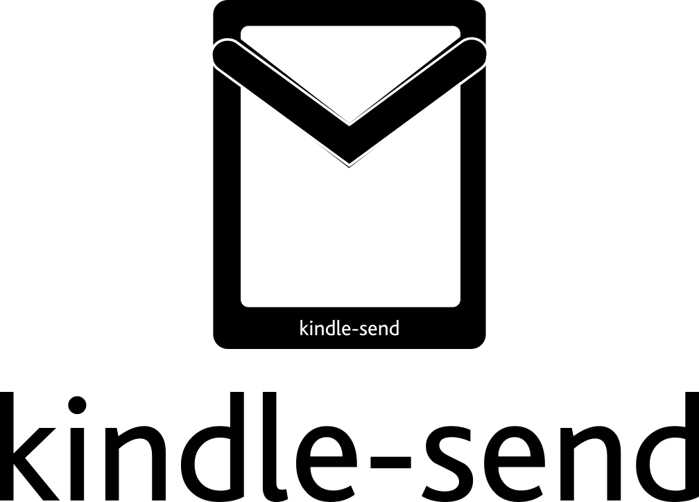

<p align = "center">

</p>

<p align = "center">
<strong>Send blogs, documents, collection of webpages to your kindle</strong>
</p>
<h3 align="center">
<a href="#contribute">Contribute</a>
<span> · </span>
<a href="#documentation">Documentation</a>
<span> · </span>
<a href="#todo">Todo</a>
</h3>

---


## Documentation

`kindle-send` is a command line utility to send files, webpages after converting them to mobi format to your kindle via e-mail. 


Webpages are optimized for viewing on kindle, thanks to [go-readability](https://github.com/go-shiori/go-readability)


An epub is created from a url, then mailed to the kindle. Amazon converts that epub into azw3 for viewing on kindle.


So you can use kindle-send, even if you're using a different ereader like Kobo and Remarkable if it supports pushing ebooks via email.


<p align="center">
  
</p>


---

### Installation

To run kindle-send you just need the compiled binary, no other dependency is required.

As this was not the case with the older [python version](https://github.com/nikhil1raghav/kindle-send/tree/python) which required percollate, calibre etc.


Download the binary for your operating system and architecture from release page and add it to your [PATH](https://en.wikipedia.org/wiki/PATH_(variable)).
If there is no binary compatible for your system. Please create an issue.


For the first time when you run `kindle-send`, you need to answer some questions to create a configuration file, which has options like sender, receiver, password and path to store the generated files.


If you're using gmail to send mails to kindle, please consider creating an [app password](https://support.google.com/mail/answer/185833?hl=en-GB) and then using it.


---


### Following modes of operation are supported

__1. Send a file__

Using `kindle-send` to mail an already existing file.

```sh
kindle-send --file <path-to-file>
```


__2. Send a webpage__

Quickly send a webpage to kindle


```sh
kindle-send  --url <link-to-a-webpage>
```


__3. Multiple webpages combined in a single volume__


Create a text file with new line separated links of webpages and then pass it as link file to `--linkfile` option


```sh
kindle-send --linkfile <path-to-url-file>
```


### Additional options

Specify the title for the document using `--title` option.

Specify a different configuration file using `--config` option. Configuration is stored in home directory as `KindleConfig.json`. You can directly edit it if you want.

When sending a collection of pages if no title is provided, volume takes the title of the first page.


---

## Contribute

Feel free to create an issue and then working on some feature, so that we don't overwrite each other.


## Todo

- [ ] Weekly RSS feed dump, when combined with `cron`
- [x] Remove dependency on percollate and calibre
- [x] Make installation easier


