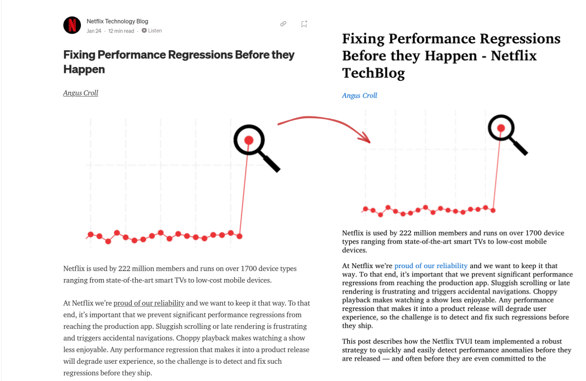

<p align = "center">

</p>

<p align = "center">
<strong>Send blogs, documents, collection of webpages to your kindle</strong>
</p>
<h3 align="center">
<a href="#contribute">Contribute</a>
<span> · </span>
<a href="#documentation">Documentation</a>
<span> · </span>
<a href="#todo">Todo</a>
</h3>

---


## Documentation

`kindle-send` is a CLI tool to send files and webpages to your e-reader via e-mail. 

Webpages are optimized for viewing on e-reader


<p align = "center">
<figure>

<figcaption>Credits - Netflix tech blog<a href="https://netflixtechblog.com/fixing-performance-regressions-before-they-happen-eab2602b86fe">Fixing Performance Regressions Before they Happen</a></figcaption>
</figure>
</p>


---


An epub is created from the url, then mailed to the kindle. Amazon converts that epub into azw3 for viewing on kindle.
So you can use kindle-send, even if you're using a different ereader like Kobo and Remarkable if it supports pushing ebooks via email.


---

### Installation

To run kindle-send you just need the compiled binary, no other dependency is required.

#### Brew

Kindle-send can be installed via brew

```sh
brew install nikhil1raghav/tap/kindle-send
```

#### Download binary

Download the binary for your operating system and architecture from [release page](https://github.com/nikhil1raghav/kindle-send/releases) and add it to your [PATH](https://en.wikipedia.org/wiki/PATH_(variable)).
If there is no binary compatible for your system. Please create an issue.


#### Go install

If you have golang installed, you can also install kindle-send using

```sh
go install github.com/nikhil1raghav/kindle-send@latest
```


For the first time when you run `kindle-send`, you need to answer some questions to create a configuration file, which has options like sender, receiver, password and path to store the generated files.


If you're using gmail to send mails to kindle, consider creating an [app password](https://support.google.com/mail/answer/185833?hl=en-GB) and then using it.


---


### Following modes of operation are supported

__1. Send a file__

Using `kindle-send` to mail an already existing file.

```sh
kindle-send send Jane-eyre-Autobiography.epub
```


<p align="center">
  
</p>


__2. Send a webpage__

Quickly send a webpage to kindle


```sh
kindle-send send http://paulgraham.com/hwh.html
```

<p align="center">
  
</p>


__3. Multiple webpages combined in a single volume__


Create a text file with new line separated links of webpages and then all the webpages mentioned in the file will be bound in a single ebook as chapters and sent to ereader.


```sh
kindle-send send links.txt
```

<p align="center">
  
</p>


__4. Send Multiple files at once__

You can send multiple files or links at once.

`kindle-send` auto detects the type of file and takes required action.


Each argument is sent as a separate file.


For example, the command below will send an html page (converted to ebook), an ebook and a collection of bookmarks post downloading the webpages and creating an ebook from them.


```sh
kindle-send send http://paulgraham.com/hwh.html jane-eyre-autobiography.epub some-links.txt
```


__5. Download but not send__

If you just want to save a webpage for reading later, replace `send` with `download` and the files will be saved in local directory but will not be sent to an ereader.

Example

```sh
kindle-send download https://blog.maxgio.me/posts/linux-scheduler-journey/
```

<p align="center">
  
</p>


### Additional options

Default timeout for mail is 2 minutes, if you get timeout error while sending bigger files. Increase the timeout using `--mail-timeout <number of seconds>` or `-m` option


Specify a different configuration file using `--config` or `-c` option. Configuration is stored in home directory as `KindleConfig.json`. You can directly edit it if you want.


When sending a collection of pages if no title is provided, volume takes the title of the first page.

You can always get more information about usage of commands and options by typing `kindle-send help`


---

## Contribute

Feel free to create an issue and then working on some feature, so that we don't overwrite each other.


## Todo

- [ ] Weekly RSS feed dump, when combined with `cron`
- [ ] Better CSS & formatting for epub
- [ ] Compressing images before embedding to reduce final file size
- [ ] Simple UI form driven by CLI. Something like `kindle-send dashboard`.
- [x] Auto detect file type
- [x] Option to download but not send the files
- [x] Remove dependency on percollate and calibre
- [x] Make installation easier, add brew and other package managers.


